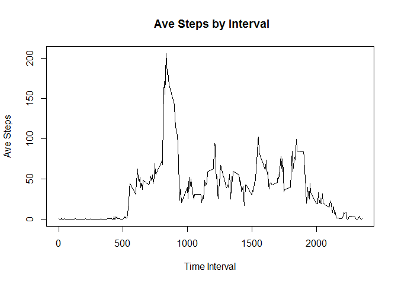

# Reproducible Research: Peer Assessment 1


## Loading and preprocessing the data
1. Loading and preprocessing the data
2. Process/transform the data (if necessary) into a format suitable for your analysis

```r
df <- read.csv("activity.csv")
df$date<-as.Date(df$date)
```

## What is mean total number of steps taken per day?
1. Make a histogram of the total number of steps taken each day

```r
byDay<-tapply(df$steps,df$date,sum,na.rm=T)
barplot(byDay)
```

 

2. Calculate and report the mean and median total number of steps taken per day

```r
mean(byDay)
```

```
## [1] 9354
```

```r
median(byDay)
```

```
## [1] 10395
```

## What is the average daily activity pattern?
1. Make a time series plot (i.e. type = "l") of the 5-minute interval (x-axis) and the average number of steps taken, averaged across all days (y-axis)

```r
AvebyInterval<-tapply(df$steps,df$interval,mean,na.rm=T)
plot(names(AvebyInterval),as.integer(AvebyInterval), ylim=range(AvebyInterval),type="n", main=" Ave Steps by Interval", xlab="Time Interval",ylab="Ave Steps")
lines(names(AvebyInterval),as.integer(AvebyInterval), type="l") 
```

 


2. Which 5-minute interval, on average across all the days in the dataset, contains the maximum number of steps?

```r
sort(AvebyInterval,decreasing=T)[1]
```

```
##   835 
## 206.2
```


## Imputing missing values
1. Calculate and report the total number of missing values in the dataset (i.e. the total number of rows with NAs)
### number of rows of data that have missing values

```r
nrow(df[!complete.cases(df),])
```

```
## [1] 2304
```
2. Devise a strategy for filling in all of the missing values in the dataset. The strategy does not need to be sophisticated. For example, you could use the mean/median for that day, or the mean for that 5-minute interval, etc.
3. Create a new dataset that is equal to the original dataset but with the missing data filled in.


```r
dfimp <- read.csv("activity.csv")
dfimp$date<-as.Date(dfimp$date)
AvebyIntervalImp<-tapply(dfimp$steps,dfimp$interval,mean,na.rm=T)
totalRowCnt <- nrow(dfimp)
 for (i in 1:totalRowCnt ) {        
             if( is.na(dfimp[i,]$steps) ){
                         dfimp[i,]$steps <- AvebyIntervalImp[[as.character(dfimp[i,]$interval)]]
                     }
         }
```

4.Make a histogram of the total number of steps taken each day and Calculate and report the mean and median total number of steps taken per day. 


```r
byDayImp<-tapply(dfimp$steps,dfimp$date,sum,na.rm=T)
barplot(byDayImp)
```

 


```r
mean(byDayImp)
```

```
## [1] 10766
```

```r
median(byDayImp)
```

```
## [1] 10766
```

Q: Do these values differ from the estimates from the first part of the assignment?

A: Values are higher

Q: What is the impact of imputing missing data on the estimates of the total daily number of steps?

A: Imputing missing values move the total daily number of steps higher.


## Are there differences in activity patterns between weekdays and weekends?
1.Create a new factor variable in the dataset with two levels - "weekday" and "weekend" indicating whether a given date is a weekday or weekend day.


```r
df$weekDayInd <- ifelse(weekdays(df$date) == "Sunday" | weekdays(df$date) == "Saturday","weekend", "weekday")
```

2. Make a panel plot containing a time series plot (i.e. type = "l") of the 5-minute interval (x-axis) and the average number of steps taken, averaged across all weekday days or weekend days (y-axis). 


```r
library(ggplot2)
weekendFactor <- aggregate( steps ~ interval+weekDayInd, data=df, FUN=mean)
qplot(interval,steps,data=weekendFactor,facets=weekDayInd~.,geom="line",xlab="interval",ylab="number of steps")
```

 

As can be seen in the time series plots, there are more steps between 9 am to 5 pm in weekends as people have more activities during that time window over the weekends.

